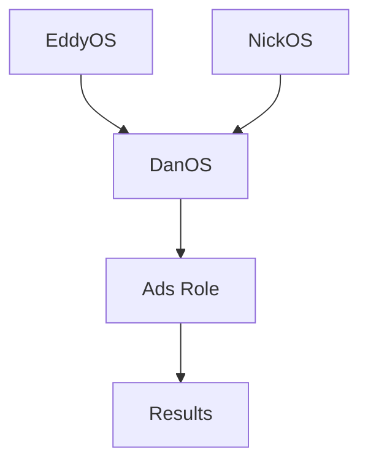
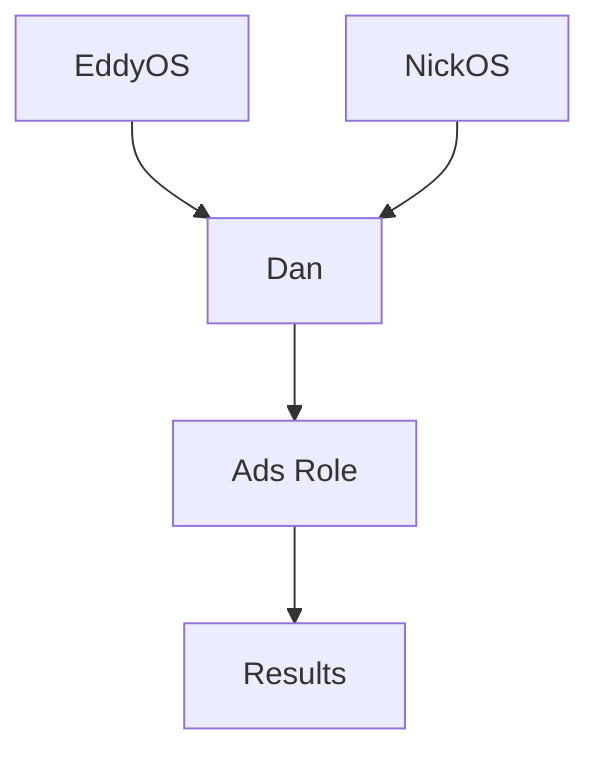

---

## CurrentOS

---

---

## CompanyOS

---

Both local `./preflight.sh` and CI execute this exact pipeline to eliminate "works on my machine" drift.

## Next-day follow-up (for any account you ticketed yesterday)

6. **Next day:** add the **new 3-day CPL** to the same ticket and check **“yesterday” CPL vs. the 7-day CPL**.

7. Is **yesterday CPL ≤ 7-day CPL** (i.e., cost is improving or holding)?

   * **Yes (trending up / better cost):**

     * Add a note: “campaign trending up.”
     * **Leave it 1 more day** and continue daily notes.
     * After that extra day, check the **3-day trend**:

       * If **3-day trend is up (getting cheaper)** → keep monitoring with daily notes.
       * If **3-day trend turns down (getting more expensive)** → go to Step 9.

   * **No (yesterday is worse than 7-day → trending down):**

     * Go to Step 8.

8. When **performance is trending down (worse cost)**:

   * Re-check the **7-day CPL vs. benchmark**.
   * **If 7-day is now worse than benchmark** → go to Step 9.
   * **If 7-day is still within benchmark** → keep the ticket open and re-check tomorrow (do not change yet).

9. **Escalation:** If the **last 7 days are worse than benchmark** after the trend check:

   * **Turn off the campaign** (or the underperforming ad set).
   * **Relaunch with different creative** (or your next best variant).
   * Document the shutdown and relaunch details in the ticket.

---

## What to write in each ticket (quick template)

* Date
* Account / Campaign / Ad set
* Benchmark CPL (target)
* 3-day CPL, 7-day CPL
* Trend note: “trending up / down / flat”
* Action taken today: **none (monitor)** | **change made (describe)** | **turned off & relaunched (describe)**
* Next check date

That’s it—same loop every day: scan → flag → 7-day check → (monitor or change) → next-day trend check → escalate if the 7-day falls below your standard.
